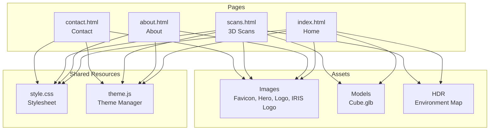

# 3D Scans Page — Implementation Plan

## Overview

Create a new page (`scans.html`) dedicated to 3D scanning services. The page will feature a 3D model viewer, benefits section, partner company showcase (IRIS), and an alternating image-text process description. A navigation button on the home page will link to this new page.

---

## Page Structure — [`scans.html`](scans.html)

| # | Section | ID/Class | Description |
|---|---------|----------|-------------|
| 1 | Header | `<header>` | Shared header with new "Scans" nav link |
| 2 | Hero | `#home.hero` | Page title "3D Scanning" with subtitle |
| 3 | 3D Model Viewer | `#model-viewer.section` | Copy of the model viewer from index.html with "Explore 3D Scans" heading |
| 4 | Benefits | `#benefits.section.bg-light` | Text section with placeholder content about benefits of 3D scanning. Uses `.services-grid` with `.service-card` items for 3 benefit cards |
| 5 | Partner Company | `#partner.section` | Centered section featuring the IRIS logo (`Images/iris-logo.png`) and partnership description text |
| 6 | 3D Imaging Process | `#process.section.bg-light` | Alternating `.content-row` blocks (image-left, image-right pattern) describing the 3D imaging process step by step |
| 7 | Footer | `<footer>` | Shared footer |

### Script Requirements

Since this page uses `<model-viewer>`, it must include the Google Model Viewer ES module script (same as `index.html`):

```html
<script type="module" src="https://ajax.googleapis.com/ajax/libs/model-viewer/4.3.0/model-viewer.min.js"></script>
```

---

## Navigation Changes

### New Button on [`index.html`](index.html)

In the `#model-viewer` section (after the `<model-viewer>` element, around line 60), add a CTA button:

```html
<a href="scans.html" class="btn">Explore 3D Scans</a>
```

Placed after the closing `</model-viewer>` tag and before the next `<h2>` heading.

### New Nav Link on All Pages

Add `<li><a href="scans.html">Scans</a></li>` to the `<nav>` in all 4 pages:
- `index.html` (after "About" link)
- `about.html` (after "About" link)
- `contact.html` (after "About" link)
- `scans.html` (new page, after "About" link)

Nav order: Home | About | Scans | Contact

---

## CSS Changes

### New Styles Needed in [`style.css`](style.css)

Only minimal new CSS is required. Most styling is handled by existing classes.

#### Partner Logo Display (for IRIS section)

```css
/* Partner showcase section */
.partner-showcase {
    text-align: center;
}

.partner-showcase img {
    max-width: 250px;
    height: auto;
    margin-bottom: 20px;
}

.partner-showcase h2 {
    margin-bottom: 20px;
}

.partner-showcase p {
    max-width: 700px;
    margin: 0 auto;
    color: var(--text-secondary);
}
```

Place this block near the existing partners logos section styles (around line 473, before the 3D Model Viewer styles).

---

## Assets

| File | Type | Notes |
|------|------|-------|
| `Images/iris-logo.png` | PNG | Already exists. Used in partner showcase section on scans page |
| `Images/hero-bg.jpg` | JPG | Reused for hero background |
| `Models/Cube.glb` | GLB | Reused for 3D model viewer |
| `HDR/tree_lined_driveway_1k.hdr` | HDR | Reused for environment lighting |

---

## Implementation Order

1. **Create `scans.html`** — Build the full page using existing patterns from `about.html` and `contact.html` as templates
2. **Add CTA button to `index.html`** — Insert "Explore 3D Scans" button in the model viewer section
3. **Add nav link to all pages** — Update header nav in `index.html`, `about.html`, `contact.html`, and `scans.html`
4. **Add new CSS to `style.css`** — Partner showcase styles
5. **Update `site-documentation.md`** — Document the new page and changes

---

## Architecture Diagram (Updated)


