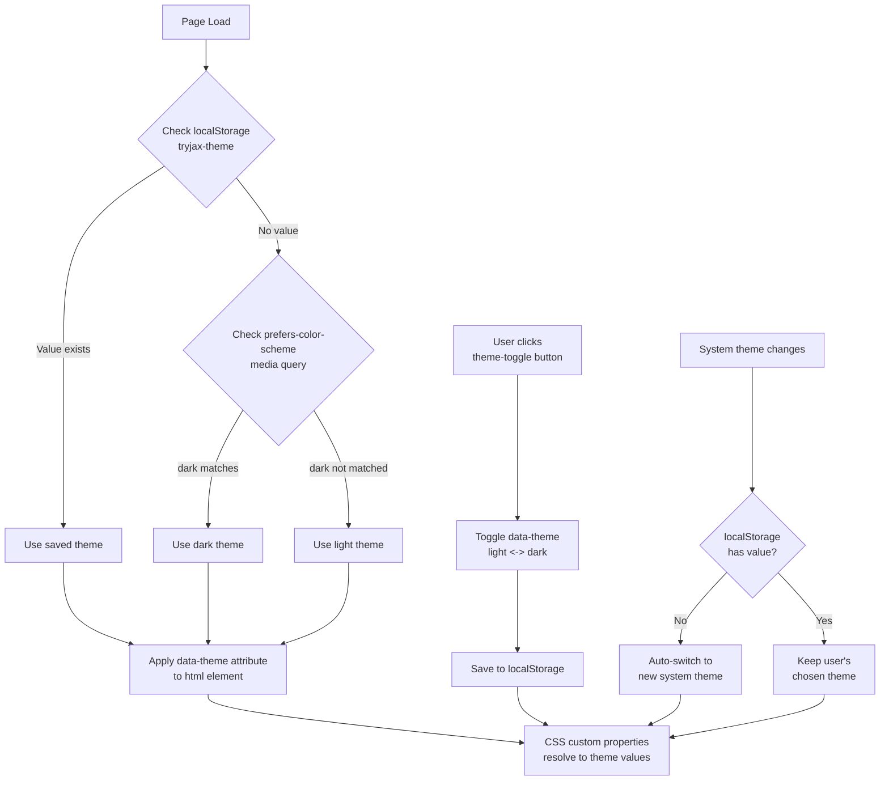

# Dark Mode Implementation Plan for Tryjax Construction Website

## 1. Codebase Analysis Summary

### Current Color Palette (Hardcoded)
| Color | Hex | Usage |
|-------|-----|-------|
| Header/Footer Background | `#2c3e50` | `header`, `footer` |
| Accent/Orange | `#e67e22` | Borders, links, highlights, button bg |
| Dark Accent | `#d35400` | Button hover |
| Primary Text | `#333` | `body` text |
| Secondary Text | `#666` | Descriptions, card text |
| Tertiary Text | `#999` | Input placeholders |
| Light Background | `#f4f4f4` | Hero, `.bg-light` sections |
| White | `#fff` | Cards, forms, header nav text |
| Border Gray | `#ddd` | Card borders, input borders |
| Black Overlay | `rgba(0,0,0,0.5)` | Hero section overlay |

### Current HTML Structure
- All 3 pages share identical `<header>` with logo + navigation + `<footer>`
- Sections use `.bg-light` class for alternating backgrounds
- No JavaScript currently exists in any page
- No CSS custom properties (variables) in use

---

## 2. CSS Architecture: Custom Properties Design

### 2.1 Root-Level CSS Custom Properties

All colors will be organized under `:root` and `[data-theme="dark"]` selectors. This creates two complete theme palettes that can be swapped by changing a single attribute on the `<html>` element.

```css
/* Light theme (default) */
:root {
  /* Background colors */
  --bg-primary: #ffffff;
  --bg-secondary: #f4f4f4;
  --bg-header: #2c3e50;
  --bg-footer: #2c3e50;
  --bg-card: #ffffff;
  --bg-form: #ffffff;
  --bg-model-viewer: #f9f9f9;

  /* Text colors */
  --text-primary: #333333;
  --text-secondary: #666666;
  --text-tertiary: #999999;
  --text-header: #ffffff;
  --text-footer: #ffffff;
  --text-on-accent: #ffffff;

  /* Accent colors */
  --accent-primary: #e67e22;
  --accent-hover: #d35400;
  --accent-border: #e67e22;

  /* Border colors */
  --border-primary: #dddddd;
  --border-focus: #e67e22;

  /* Shadows */
  --shadow-card: 0 2px 5px rgba(0, 0, 0, 0.1);
  --shadow-card-hover: 0 5px 15px rgba(0, 0, 0, 0.1);
  --shadow-form: 0 4px 15px rgba(0, 0, 0, 0.1);
  --shadow-model: 0 4px 10px rgba(0, 0, 0, 0.1);

  /* Hero overlay */
  --hero-overlay: rgba(0, 0, 0, 0.5);
}

/* Dark theme */
[data-theme="dark"] {
  /* Background colors */
  --bg-primary: #1a1a2e;
  --bg-secondary: #16213e;
  --bg-header: #0f3460;
  --bg-footer: #0f3460;
  --bg-card: #1f2937;
  --bg-form: #1f2937;
  --bg-model-viewer: #1f2937;

  /* Text colors */
  --text-primary: #e5e7eb;
  --text-secondary: #9ca3af;
  --text-tertiary: #6b7280;
  --text-header: #ffffff;
  --text-footer: #ffffff;
  --text-on-accent: #ffffff;

  /* Accent colors */
  --accent-primary: #e67e22;
  --accent-hover: #f39c12;
  --accent-border: #e67e22;

  /* Border colors */
  --border-primary: #374151;
  --border-focus: #e67e22;

  /* Shadows */
  --shadow-card: 0 2px 5px rgba(0, 0, 0, 0.3);
  --shadow-card-hover: 0 5px 15px rgba(0, 0, 0, 0.4);
  --shadow-form: 0 4px 15px rgba(0, 0, 0, 0.3);
  --shadow-model: 0 4px 10px rgba(0, 0, 0, 0.3);

  /* Hero overlay - lighter for dark mode */
  --hero-overlay: rgba(0, 0, 0, 0.3);
}
```

### 2.2 CSS Changes Required (style.css)

Every hardcoded color value in the existing CSS must be replaced with the appropriate custom property:

| Element/Selector | Current Value | Replacement |
|-----------------|---------------|-------------|
| `body` color | `#333` | `var(--text-primary)` |
| `body` background | (none) | `var(--bg-primary)` |
| `header` background | `#2c3e50` | `var(--bg-header)` |
| `header nav a` color | `#fff` | `var(--text-header)` |
| `header nav ul li a:hover` background | `#e67e22` | `var(--accent-primary)` |
| `.hero` background-color | `#f4f4f4` | `var(--bg-secondary)` |
| `#home::before` background | `rgba(0,0,0,0.5)` | `var(--hero-overlay)` |
| `.btn` background | `#e67e22` | `var(--accent-primary)` |
| `.btn:hover` background | `#d35400` | `var(--accent-hover)` |
| `.section.bg-light` background | `#f4f4f4` | `var(--bg-secondary)` |
| `.service-card` background | `#fff` | `var(--bg-card)` |
| `.service-card` border | `#ddd` | `var(--border-primary)` |
| `.service-card h3` color | `#e67e22` | `var(--accent-primary)` |
| `.service-card` box-shadow | `rgba(0,0,0,0.1)` | `var(--shadow-card)` |
| `.team-card` background | `#fff` | `var(--bg-card)` |
| `.team-card` box-shadow | `rgba(0,0,0,0.1)` | `var(--shadow-card)` |
| `.team-card img` border | `#e67e22` | `var(--accent-border)` |
| `.team-card h3` color | `#2c3e50` | `var(--text-primary)` |
| `.team-card p:first-of-type` color | `#e67e22` | `var(--accent-primary)` |
| `.team-card p:last-of-type` color | `#666` | `var(--text-secondary)` |
| `.client-card` background | `#fff` | `var(--bg-card)` |
| `.client-card` box-shadow | `rgba(0,0,0,0.05)` | `var(--shadow-card)` |
| `.client-card:hover` box-shadow | `rgba(0,0,0,0.1)` | `var(--shadow-card-hover)` |
| `model-viewer` background | `#f9f9f9` | `var(--bg-model-viewer)` |
| `model-viewer` border | `#ddd` | `var(--border-primary)` |
| `model-viewer` box-shadow | `rgba(0,0,0,0.1)` | `var(--shadow-model)` |
| `.form-container` background | `#fff` | `var(--bg-form)` |
| `.form-container` box-shadow | `rgba(0,0,0,0.1)` | `var(--shadow-form)` |
| `.form-group label` color | `#2c3e50` | `var(--text-primary)` |
| `.form-group input`, `textarea` border | `#ddd` | `var(--border-primary)` |
| `.form-group input`, `textarea` color | `#333` | `var(--text-primary)` |
| `.form-group input:focus`, `textarea:focus` border-color | `#e67e22` | `var(--border-focus)` |
| `.form-group input::placeholder`, `textarea::placeholder` | `#999` | `var(--text-tertiary)` |
| `footer` background | `#2c3e50` | `var(--bg-footer)` |

### 2.3 Theme Toggle Button Styles

New CSS for the theme toggle button:

```css
/* Theme Toggle Button */
.theme-toggle {
  background: transparent;
  border: 2px solid var(--accent-primary);
  color: var(--text-header);
  padding: 6px 12px;
  border-radius: 20px;
  cursor: pointer;
  font-size: 14px;
  transition: background-color 0.3s ease, color 0.3s ease;
  display: flex;
  align-items: center;
  gap: 6px;
  margin-left: 10px;
}

.theme-toggle:hover {
  background-color: var(--accent-primary);
  color: var(--text-on-accent);
}

.theme-toggle .icon {
  font-size: 16px;
  line-height: 1;
}

/* Mobile responsive */
@media (max-width: 768px) {
  .theme-toggle {
    padding: 4px 8px;
    font-size: 12px;
  }
}
```

---

## 3. JavaScript Theme Management

### 3.1 Theme Manager Module

A single JavaScript file (`theme.js`) will be created with the following functionality:

```javascript
/**
 * Theme Manager - Handles dark mode detection, switching, and persistence
 */
const ThemeManager = (() => {
  const STORAGE_KEY = 'tryjax-theme';
  const DATA_ATTRIBUTE = 'data-theme';

  /**
   * Determine the initial theme preference
   */
  function getInitialTheme() {
    // 1. Check localStorage first (user's explicit choice)
    const savedTheme = localStorage.getItem(STORAGE_KEY);
    if (savedTheme) {
      return savedTheme;
    }

    // 2. Fall back to system preference
    if (window.matchMedia && window.matchMedia('(prefers-color-scheme: dark)').matches) {
      return 'dark';
    }

    // 3. Default to light
    return 'light';
  }

  /**
   * Apply theme to the document
   */
  function applyTheme(theme) {
    document.documentElement.setAttribute(DATA_ATTRIBUTE, theme);
    localStorage.setItem(STORAGE_KEY, theme);
    updateToggleButtonText(theme);
  }

  /**
   * Toggle between light and dark themes
   */
  function toggleTheme() {
    const currentTheme = document.documentElement.getAttribute(DATA_ATTRIBUTE);
    const newTheme = currentTheme === 'dark' ? 'light' : 'dark';
    applyTheme(newTheme);
  }

  /**
   * Listen for system theme changes
   */
  function listenForSystemChanges() {
    const mediaQuery = window.matchMedia('(prefers-color-scheme: dark)');
    
    const handler = (e) => {
      // Only auto-switch if user hasn't made an explicit choice
      if (!localStorage.getItem(STORAGE_KEY)) {
        applyTheme(e.matches ? 'dark' : 'light');
      }
    };

    // Modern API
    if (mediaQuery.addEventListener) {
      mediaQuery.addEventListener('change', handler);
    } else if (mediaQuery.addListener) {
      // Fallback for older browsers
      mediaQuery.addListener(handler);
    }
  }

  /**
   * Update the toggle button text/icon based on current theme
   */
  function updateToggleButtonText(theme) {
    const toggleBtn = document.querySelector('.theme-toggle');
    if (toggleBtn) {
      const icon = toggleBtn.querySelector('.icon');
      const text = toggleBtn.querySelector('.label');
      if (icon) {
        icon.textContent = theme === 'dark' ? '\u2600\uFE0F' : '\uD83C\uDF19';
      }
      if (text) {
        text.textContent = theme === 'dark' ? 'Light' : 'Dark';
      }
    }
  }

  /**
   * Initialize the theme manager
   */
  function init() {
    const initialTheme = getInitialTheme();
    applyTheme(initialTheme);
    listenForSystemChanges();

    // Attach click handler to toggle button
    const toggleBtn = document.querySelector('.theme-toggle');
    if (toggleBtn) {
      toggleBtn.addEventListener('click', toggleTheme);
    }
  }

  return { init };
})();

// Initialize when DOM is ready
if (document.readyState === 'loading') {
  document.addEventListener('DOMContentLoaded', ThemeManager.init);
} else {
  ThemeManager.init();
}
```

### 3.2 JavaScript File Inclusion

The `theme.js` script will be added to the `<head>` of **all three HTML pages** (before `</head>`):

```html
<script src="theme.js"></script>
```

---

## 4. HTML Changes: Theme Toggle Button Placement

### 4.1 Toggle Button Location

The theme toggle button will be placed inside the `<header>` element, within the navigation `<ul>`, after the last nav item. This keeps it visible and accessible from all pages.

### 4.2 Header Navigation Changes (All Pages)

**Current:**
```html
<nav>
    <ul>
        <li><a href="index.html">Home</a></li>
        <li><a href="about.html">About</a></li>
        <li><a href="contact.html">Contact</a></li>
    </ul>
</nav>
```

**New:**
```html
<nav>
    <ul>
        <li><a href="index.html">Home</a></li>
        <li><a href="about.html">About</a></li>
        <li><a href="contact.html">Contact</a></li>
        <li>
            <button class="theme-toggle" aria-label="Toggle dark mode">
                <span class="icon">\uD83C\uDF19</span>
                <span class="label">Dark</span>
            </button>
        </li>
    </ul>
</nav>
```

### 4.3 Script Tag Addition (All Pages)

Add to `<head>` section of each page, after the `<link rel="stylesheet">` tags:

```html
<script src="theme.js"></script>
```

---

## 5. Step-by-Step Implementation Order

### Phase 1: CSS Custom Properties Setup

1. **Add `:root` CSS custom properties block** at the top of `style.css` (after the general reset)
   - Define all light theme variables
   - Include comments for organization

2. **Add `[data-theme="dark"]` CSS custom properties block** after the `:root` block
   - Define all dark theme variables
   - Ensure all values create a cohesive dark palette

3. **Add theme toggle button styles** at the end of `style.css`
   - `.theme-toggle` base styles
   - `.theme-toggle:hover` styles
   - Responsive media query adjustments

### Phase 2: CSS Property Migration

4. **Update body and section backgrounds**
   - `body`: add `background-color: var(--bg-primary)`
   - `.section.bg-light`: change `background-color` to `var(--bg-secondary)`

5. **Update header and footer**
   - `header`: change `background` to `var(--bg-header)`
   - `footer`: change `background` to `var(--bg-footer)`
   - Header nav text colors to `var(--text-header)`

6. **Update text colors**
   - `body`: change `color` to `var(--text-primary)`
   - Secondary text elements to `var(--text-secondary)`
   - Placeholder text to `var(--text-tertiary)`

7. **Update card and component backgrounds**
   - `.service-card`, `.team-card`, `.client-card`: change `background` to `var(--bg-card)`
   - `.form-container`: change `background` to `var(--bg-form)`

8. **Update borders and shadows**
   - All card borders to `var(--border-primary)`
   - All box-shadows to use `var(--shadow-*)` variables
   - Form input focus borders to `var(--border-focus)`

9. **Update accent colors**
   - `.btn` background to `var(--accent-primary)`
   - `.btn:hover` background to `var(--accent-hover)`
   - `.service-card h3`, `.team-card p:first-of-type` to `var(--accent-primary)`

10. **Update model-viewer styles**
    - `model-viewer` background to `var(--bg-model-viewer)`
    - Border and shadow variables

11. **Update hero overlay**
    - `#home::before` background to `var(--hero-overlay)`

### Phase 3: HTML Changes

12. **Add theme toggle button to all three HTML pages**
    - Add `<script src="theme.js"></script>` in `<head>`
    - Add theme toggle `<li>` in navigation `<ul>`

### Phase 4: JavaScript Implementation

13. **Create `theme.js` file** with the ThemeManager module (see Section 3.1)

### Phase 5: Testing

14. **Test across all pages and scenarios**
    - Verify light mode renders correctly on all pages
    - Verify dark mode renders correctly on all pages
    - Test toggle button functionality
    - Test localStorage persistence (refresh pages)
    - Test system preference detection (change OS theme)
    - Test responsive layout with toggle button
    - Verify `prefers-color-scheme` media query listener

---

## 6. File Change Summary

| File | Changes |
|------|---------|
| `style.css` | Add CSS custom properties (`:root` + `[data-theme="dark"]`), add toggle button styles, migrate all hardcoded colors to variables |
| `theme.js` | **NEW FILE** - ThemeManager module |
| `index.html` | Add `<script src="theme.js">`, add toggle button in nav |
| `about.html` | Add `<script src="theme.js">`, add toggle button in nav |
| `contact.html` | Add `<script src="theme.js">`, add toggle button in nav |

---

## 7. Dark Mode Color Reference

For visual reference, here is the complete dark theme palette:

```
Background Colors:
  Primary:     #1a1a2e (main page background)
  Secondary:   #16213e (alternating sections)
  Header:      #0f3460 (header bar)
  Footer:      #0f3460 (footer bar)
  Card:        #1f2937 (service cards, team cards, forms)
  Model Viewer:#1f2937 (3D model background)

Text Colors:
  Primary:     #e5e7eb (main text)
  Secondary:   #9ca3af (descriptions)
  Tertiary:    #6b7280 (placeholders)
  Header:      #ffffff (header nav text)
  Footer:      #ffffff (footer text)

Accent:
  Primary:     #e67e22 (buttons, highlights - kept warm orange)
  Hover:       #f39c12 (brighter orange on hover)
  Border:      #e67e22 (focus states)

Borders:
  Primary:     #374151 (card borders, input borders)
  Focus:       #e67e22 (input focus ring)

Shadows:
  Card:        0 2px 5px rgba(0, 0, 0, 0.3)
  Card Hover:  0 5px 15px rgba(0, 0, 0, 0.4)
  Form:        0 4px 15px rgba(0, 0, 0, 0.3)
  Model:       0 4px 10px rgba(0, 0, 0, 0.3)

Hero Overlay:
  Dark:        rgba(0, 0, 0, 0.3) (lighter for dark mode)
```

---

## 8. Architecture Diagram



---

## 9. Best Practices Applied

1. **CSS Custom Properties over media queries**: Using `[data-theme]` attribute selector instead of `@media (prefers-color-scheme)` alone, because it allows manual override while still respecting system preference as the default.

2. **Progressive enhancement**: The site works perfectly without JavaScript. The toggle button and persistence are enhancements.

3. **No flash of wrong theme**: Theme is applied synchronously via `data-theme` attribute before paint, preventing FOUC (Flash of Unstyled Content).

4. **Semantic HTML**: Theme toggle uses `<button>` element with `aria-label` for accessibility.

5. **localStorage key namespacing**: Using `tryjax-theme` instead of just `theme` to avoid conflicts with other scripts.

6. **IIFE pattern**: ThemeManager uses Immediately Invoked Function Expression to avoid polluting global scope.

7. **Graceful degradation**: `matchMedia` listener has fallback for older browsers.
