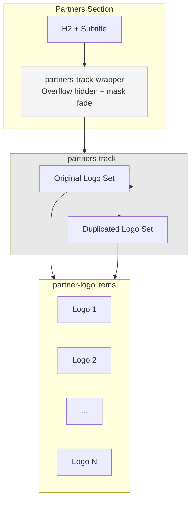

# Partners Logo Scrolling Section — Design Specification

> Technical specification for adding a horizontally scrolling partners logos section to the Tryjax Construction website.

---

## 1. Overview

| Property | Value |
|----------|-------|
| **Feature** | Infinite horizontal scrolling partners logo carousel |
| **Placement** | New section on `index.html` between "What We Do" and Footer |
| **Animation** | Pure CSS `@keyframes` — no JavaScript required |
| **Theming** | Full dark/light mode support via CSS custom properties |
| **Responsive** | Adapts at existing `768px` breakpoint |

---

## 2. Design Decisions

### 2.1 Why Pure CSS Animation?

- **Performance:** GPU-accelerated `transform` animations run on the compositor thread, avoiding main-thread jank
- **Simplicity:** Zero JavaScript dependency, no runtime overhead
- **Reliability:** Works even if JavaScript is disabled
- **Accessibility:** Respects `prefers-reduced-motion` automatically

### 2.2 Why Infinite Seamless Scroll?

- **Industry standard:** Commonly used pattern for partner/client showcases
- **Space efficient:** Shows many logos in a compact vertical footprint
- **Eye-catching:** Subtle motion draws attention without being distracting
- **Modern feel:** Signals a polished, professional website

### 2.3 Why Place on Index Page?

- **Primary visibility:** Homepage is the first impression
- **Social proof:** Partners logos build trust early in the visitor journey
- **Complements existing content:** Fits naturally after "What We Do" and before the footer

---

## 3. HTML Structure

### 3.1 Section Markup

The section will be inserted in [`index.html`](index.html) after the "What We Do" section (line ~115) and before the `<footer>`:

```html
<!-- Partners Logos Section -->
<section id="partners" class="section partners-section">
    <div class="container">
        <h2>Our Partners</h2>
        <p style="text-align: center; margin-bottom: 30px; color: var(--text-secondary);">Trusted by leading brands and organizations nationwide.</p>
    </div>
    <div class="partners-track-wrapper">
        <div class="partners-track">
            <!-- Original set of logos -->
            <div class="partner-logo">
                
            </div>
            <div class="partner-logo">
                
            </div>
            <div class="partner-logo">
                
            </div>
            <div class="partner-logo">
                
            </div>
            <div class="partner-logo">
                
            </div>
            <div class="partner-logo">
                
            </div>
            <div class="partner-logo">
                
            </div>
            <div class="partner-logo">
                
            </div>
            <!-- Duplicated set for seamless loop -->
            <div class="partner-logo">
                
            </div>
            <div class="partner-logo">
                
            </div>
            <div class="partner-logo">
                
            </div>
            <div class="partner-logo">
                
            </div>
            <div class="partner-logo">
                
            </div>
            <div class="partner-logo">
                
            </div>
            <div class="partner-logo">
                
            </div>
            <div class="partner-logo">
                
            </div>
        </div>
    </div>
</section>
```

### 3.2 Structure Explanation

| Element | Role |
|---------|------|
| `.partners-section` | Section wrapper with background and spacing |
| `.container` | Centered heading and subtitle area |
| `.partners-track-wrapper` | Full-width overflow container (hides logos entering/exiting) |
| `.partners-track` | Animated row that translates horizontally. Contains **two identical sets** of logos for the seamless loop |
| `.partner-logo` | Individual logo container with consistent sizing and styling |

### 3.3 Seamless Loop Mechanism

The track contains **two identical copies** of the logo set. The CSS animation translates the track from `translateX(0)` to `translateX(-50%)`, at which point the visual state is identical to the start (because the second set is now in the position where the first set started). The animation then instantly resets to `0`, creating an infinite seamless loop.

---

## 4. CSS Architecture

### 4.1 New CSS Custom Properties

No new custom properties are needed. The section will use existing variables:

| Variable | Usage |
|----------|-------|
| `--bg-secondary` | Section background (via `.bg-light` class or direct) |
| `--text-secondary` | Subtitle text color |
| `--text-primary` | Section heading color |
| `--bg-card` | Individual logo card background |
| `--border-primary` | Logo card border |
| `--shadow-card` | Logo card shadow |

### 4.2 New CSS Classes

#### Section Wrapper

```css
/* Partners Logos Section */
.partners-section {
    padding: 40px 0;
    background-color: var(--bg-secondary);
    overflow: hidden;
}

.partners-section h2 {
    text-align: center;
    margin-bottom: 10px;
}
```

#### Track Wrapper (Overflow Container)

```css
.partners-track-wrapper {
    width: 100%;
    overflow: hidden;
    position: relative;
    padding: 20px 0;
    /* Fade edges for smooth visual transition */
    mask-image: linear-gradient(
        to right,
        transparent 0%,
        black 10%,
        black 90%,
        transparent 100%
    );
    -webkit-mask-image: linear-gradient(
        to right,
        transparent 0%,
        black 10%,
        black 90%,
        transparent 100%
    );
}
```

#### Animated Track

```css
.partners-track {
    display: flex;
    gap: 40px;
    align-items: center;
    width: max-content;
    animation: partnersScroll 30s linear infinite;
}

.partners-track:hover {
    animation-play-state: paused;
}
```

#### Logo Items

```css
.partner-logo {
    flex-shrink: 0;
    background: var(--bg-card);
    border: 1px solid var(--border-primary);
    border-radius: 8px;
    padding: 15px 25px;
    display: flex;
    align-items: center;
    justify-content: center;
    height: 100px;
    width: 180px;
    box-shadow: var(--shadow-card);
    transition: transform 0.3s ease, box-shadow 0.3s ease;
}

.partner-logo:hover {
    transform: scale(1.05);
    box-shadow: var(--shadow-card-hover);
}

.partner-logo img {
    max-width: 100%;
    max-height: 60px;
    object-fit: contain;
    opacity: 0.6;
    transition: opacity 0.3s ease;
    filter: grayscale(100%);
}

.partner-logo:hover img {
    opacity: 1;
    filter: grayscale(0%);
}
```

#### Keyframes Animation

```css
@keyframes partnersScroll {
    0% {
        transform: translateX(0);
    }
    100% {
        transform: translateX(-50%);
    }
}
```

#### Reduced Motion Support

```css
@media (prefers-reduced-motion: reduce) {
    .partners-track {
        animation: none;
        justify-content: center;
        width: 100%;
        flex-wrap: wrap;
    }

    .partners-track-wrapper {
        mask-image: none;
        -webkit-mask-image: none;
        padding: 20px 0;
    }
}
```

#### Responsive Adjustments

```css
@media (max-width: 768px) {
    .partners-track {
        gap: 20px;
        animation-duration: 20s;
    }

    .partner-logo {
        width: 140px;
        height: 80px;
        padding: 10px 15px;
    }

    .partner-logo img {
        max-height: 45px;
    }
}
```

---

## 5. Accessibility Considerations

| Concern | Solution |
|---------|----------|
| **Motion sensitivity** | `prefers-reduced-motion: reduce` disables animation and falls back to a static flex-wrap layout |
| **Screen readers** | Section heading (`<h2>`) and descriptive subtitle provide context. Each `` has a meaningful `alt` attribute |
| **Hover pause** | Animation pauses on `:hover` for users who want to examine specific logos |
| **Focus management** | No interactive elements requiring keyboard focus (passive display section) |
| **Color contrast** | Logos use grayscale filter by default for visual consistency, full color on hover |

---

## 6. Implementation Order

1. **Add CSS to `style.css`** — Append new partner section styles after the Clients Grid section (after line ~345)
2. **Add HTML to `index.html`** — Insert new section after "What We Do" section (after line ~115), before `<footer>`
3. **Update `plans/site-documentation.md`** — Document the new section following existing patterns

---

## 7. Future Enhancements (Out of Scope)

| Enhancement | Description |
|-------------|-------------|
| Vertical scrolling variant | Same concept but scrolling top-to-bottom for sidebar placements |
| Variable speed control | CSS custom property to tune scroll speed without editing keyframes |
| Partner link support | Wrap logo `` in `<a>` tags to link to partner websites |
| About page integration | Add same scrolling section to `about.html` to replace or complement the static `#clients` grid |

---

## 8. Architecture Diagram



---

*Design specification for the partners logo scrolling section. Follow this specification when implementing.*
