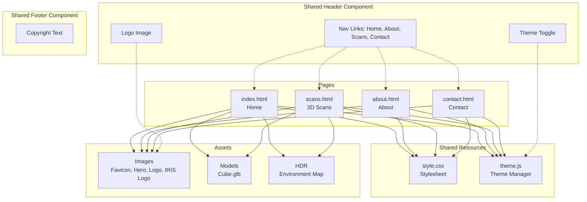

# Tryjax Construction Website — Site Documentation

> This document is the primary reference for the Tryjax Construction static website. It is written primarily for AI agents working on this codebase, but may also serve as human-facing documentation in the future.

---

## 1. Project Overview

| Property | Value |
|----------|-------|
| **Site Name** | Tryjax Construction |
| **Type** | Static multi-page website (no backend, no framework) |
| **Pages** | 4 (`index.html`, `about.html`, `scans.html`, `contact.html`) |
| **Stylesheet** | 1 shared file (`style.css`) |
| **JavaScript** | 1 shared file (`theme.js`) |
| **External Dependencies** | Google Model Viewer (`model-viewer` v4.3.0) — loaded via CDN as ES module |
| **Theming** | CSS custom properties with light/dark toggle via `data-theme` attribute |
| **Responsive** | Yes, single breakpoint at `768px` |

### Directory Structure

```
TryjaxWebsite/
├── index.html          # Home page (hero, 3D model viewer, alternating content rows, partners carousel)
├── about.html          # About page (hero, team grid, clients grid)
├── scans.html          # 3D Scans page (hero, 3D model viewer, benefits, partner showcase, process steps)
├── contact.html        # Contact page (hero, contact info cards, contact form)
├── style.css           # Shared stylesheet (all styles, theming, responsive)
├── theme.js            # Theme manager (dark mode toggle, persistence, system detection)
├── HDR/
│   └── tree_lined_driveway_1k.hdr   # HDR environment map for 3D model lighting
├── Images/
│   ├── Favicon.png     # Site favicon
│   ├── hero-bg.jpg                        # Hero section background image
│   ├── iris-logo.png                      # IRIS partner company logo (original)
│   ├── irisLogoTransparent.png            # IRIS logo for dark mode (transparent bg)
│   ├── irisLogoTransparentInverted.png    # IRIS logo for light mode (inverted, transparent bg)
│   ├── Logo.jpeg                          # Placeholder logo used in team/client cards
│   └── LogoText.png                       # Logo used in header navigation
├── Models/
│   └── Cube.glb        # 3D model for model-viewer component
└── plans/
    ├── dark-mode-implementation-plan.md
    └── site-documentation.md       # This file
```

---

## 2. Page Reference

### 2.1 [`index.html`](index.html) — Home Page

**Title:** `Tryjax Construction`

**Sections (top to bottom):**

| # | Section | ID/Class | Description |
|---|---------|----------|-------------|
| 1 | Header | `<header>` | Shared header with logo image + nav links + theme toggle button |
| 2 | Hero | `#home.hero` | Full-width background image (`hero-bg.jpg`) with overlay. Contains H1 tagline, subtitle paragraph, and CTA `.btn` linking to `contact.html` |
| 3 | 3D Model Viewer | `#model-viewer.section` | Contains a `<model-viewer>` element displaying `Models/Cube.glb` with HDR environment lighting. Features camera controls, auto-rotate, and custom camera orbit |
| 4 | What We Do | `.section.bg-light` | Alternating image-text layout using `.content-row` blocks. Four rows total, alternating left-image and right-image (via `.reverse` class). Covers: Modern Commercial Spaces, National Development, Renovation and Remodeling, Sustainable Building Practices |
| 5 | Partners Logos | `#partners.section.partners-section` | Infinite horizontal scrolling carousel of partner logos using pure CSS animation. Contains heading, subtitle, and a `.partners-track-wrapper` with edge-fade mask. Two identical sets of 8 `.partner-logo` items create a seamless loop via `translateX(-50%)` keyframe animation. Pauses on hover. Respects `prefers-reduced-motion` |
| 6 | Footer | `<footer>` | Copyright text |

**Special Notes:**
- This is the only page that loads the `model-viewer` ES module from Google CDN
- Uses `100dvh` dynamic viewport height on the body

---

### 2.2 [`about.html`](about.html) — About Page

**Title:** `About Us - Tryjax Construction`

**Sections (top to bottom):**

| # | Section | ID/Class | Description |
|---|---------|----------|-------------|
| 1 | Header | `<header>` | Same shared header as index |
| 2 | Hero | `#home.hero` | Page title "About Us" with subtitle. Uses same `hero-bg.jpg` background |
| 3 | About Text | `#about.section` | Short company description paragraph |
| 4 | Team | `#team.section.bg-light` | Team member grid using `.team-grid` (3 columns, auto-fit). Each `.team-card` has a circular avatar image, name, role, and bio |
| 5 | Clients | `#clients.section` | Client logo grid using `.clients-grid`. Six `.client-card` items with hover lift effect |
| 6 | Footer | `<footer>` | Same shared footer |

---

### 2.3 [`contact.html`](contact.html) — Contact Page

**Title:** `Contact Us - Tryjax Construction`

**Sections (top to bottom):**

| # | Section | ID/Class | Description |
|---|---------|----------|-------------|
| 1 | Header | `<header>` | Same shared header |
| 2 | Hero | `#home.hero` | Page title "Get In Touch" with subtitle |
| 3 | Contact Info | `#contact-info.section` | Three `.service-card` items in a `.services-grid` displaying Phone, Email, and Location information |
| 4 | Contact Form | `#contact-form.section.bg-light` | Form inside `.form-container`. Fields: Full Name, Email, Phone, Subject (two per `.form-row`), Message (full-width textarea). Submit button uses `.btn.submit-btn` classes |
| 5 | Footer | `<footer>` | Same shared footer |

---

### 2.4 [`scans.html`](scans.html) — 3D Scans Page

**Title:** `3D Scanning - Tryjax Construction`

**Sections (top to bottom):**

| # | Section | ID/Class | Description |
|---|---------|----------|-------------|
| 1 | Header | `<header>` | Same shared header with "Scans" nav link |
| 2 | Hero | `#home.hero` | Page title "3D Scanning" with subtitle |
| 3 | 3D Model Viewer | `#model-viewer.section` | `<model-viewer>` element displaying `Models/Cube.glb` with HDR lighting. Same configuration as home page. Includes "Explore 3D Scans" heading |
| 4 | Benefits | `#benefits.section.bg-light` | Three `.service-card` items in `.services-grid` covering: Pinpoint Accuracy, Faster Project Timeline, Seamless Franchise Fit |
| 5 | Partner Company | `#partner.section` | Centered `.partner-showcase` section featuring two theme-switched IRIS logos (`Images/irisLogoTransparentInverted.png` in light mode, `Images/irisLogoTransparent.png` in dark mode) and partnership description. Uses `.iris-logo-light` / `.iris-logo-dark` CSS classes toggled by `[data-theme]` attribute |
| 6 | 3D Imaging Process | `#process.section.bg-light` | Alternating `.content-row` blocks (four rows, alternating left-image and right-image via `.reverse` class). Covers: On-Site Scan, Data Processing, Model Review, Build & Deliver |
| 7 | Footer | `<footer>` | Same shared footer |

**Special Notes:**
- This page loads the `model-viewer` ES module from Google CDN (same as `index.html`)

**Special Notes:**
- Form has no `action` attribute — currently a static/placeholder form with no backend integration
- No form validation JavaScript exists

---

## 3. Shared Components

### 3.1 Header (All Pages)

```html
<header>
    <div class="container">
        <a href="index.html" class="logo"></a>
        <nav>
            <ul>
                <li><a href="index.html">Home</a></li>
                <li><a href="about.html">About</a></li>
                <li><a href="scans.html">Scans</a></li>
                <li><a href="contact.html">Contact</a></li>
                <li>
                    <button class="theme-toggle" aria-label="Toggle dark mode">
                        <span class="icon">🌙</span>
                        <span class="label">Dark</span>
                    </button>
                </li>
            </ul>
        </nav>
    </div>
</header>
```

- Flexbox layout with logo left, nav right
- Logo is an `` inside an `<a>` link
- Nav items are flex-aligned with full-height hover backgrounds
- Theme toggle button is the last nav item

### 3.2 Footer (All Pages)

```html
<footer>
    <div class="container">
        <p>&copy; 2026 Tryjax Construction. All rights reserved.</p>
    </div>
</footer>
```

- `margin-top: auto` on footer pushes it to the bottom via flexbox column on `<body>`

### 3.3 Hero Section (All Pages)

All pages use the same hero structure with `id="home"` and class `hero`. The background image (`hero-bg.jpg`) and dark overlay (`::before` pseudo-element) are identical across pages. Only the inner text (H1 and paragraph) changes per page.

---

## 4. CSS Architecture

### 4.1 File: [`style.css`](style.css)

Single stylesheet for the entire site. No CSS preprocessor or module bundling.

**Organization (top to bottom):**
1. CSS Custom Properties (`:root` and `[data-theme="dark"]`)
2. Body reset and `.container`
3. Header styles
4. Hero section styles
5. Section base styles
6. Services grid + cards
7. Team grid + cards
8. Clients grid + cards
9. Partners logos section (with `@keyframes partnersScroll`)
10. 3D Model Viewer styles
10. Contact Form styles
11. Footer styles
12. Theme Toggle button styles
13. Alternating Image-Text content rows
14. Responsive media queries (interspersed near relevant sections)

### 4.2 CSS Custom Properties (Theming System)

All colors are managed through CSS custom properties defined on `:root` (light theme) and `[data-theme="dark"]` (dark theme). The JavaScript `theme.js` toggles the `data-theme` attribute on the `<html>` element.

#### Light Theme Variables (`:root`)

| Variable | Value | Usage |
|----------|-------|-------|
| `--bg-primary` | `#ffffff` | Main page background |
| `--bg-secondary` | `#f4f4f4` | Alternating section backgrounds (`.bg-light`) |
| `--bg-header` | `#2c3e50` | Header background |
| `--bg-footer` | `#2c3e50` | Footer background |
| `--bg-card` | `#ffffff` | Card backgrounds (service, team, client) |
| `--bg-form` | `#ffffff` | Form container background |
| `--bg-model-viewer` | `#f9f9f9` | 3D model viewer background |
| `--text-primary` | `#333333` | Main body text |
| `--text-secondary` | `#666666` | Descriptions, secondary text |
| `--text-tertiary` | `#999999` | Placeholder text |
| `--text-header` | `#ffffff` | Header nav text |
| `--text-footer` | `#ffffff` | Footer text |
| `--text-on-accent` | `#ffffff` | Text on accent-colored backgrounds |
| `--accent-primary` | `#e67e22` | Buttons, highlights, card titles |
| `--accent-hover` | `#d35400` | Button/card hover states |
| `--accent-border` | `#e67e22` | Borders on accent elements |
| `--border-primary` | `#dddddd` | Card/input borders |
| `--border-focus` | `#e67e22` | Input focus ring |
| `--shadow-card` | `0 2px 5px rgba(0,0,0,0.1)` | Default card shadow |
| `--shadow-card-hover` | `0 5px 15px rgba(0,0,0,0.1)` | Hover card shadow |
| `--shadow-form` | `0 4px 15px rgba(0,0,0,0.1)` | Form container shadow |
| `--shadow-model` | `0 4px 10px rgba(0,0,0,0.1)` | Model viewer shadow |
| `--hero-overlay` | `rgba(0,0,0,0.5)` | Hero section dark overlay |

#### Dark Theme Overrides (`[data-theme="dark"]`)

| Variable | Value | Notes |
|----------|-------|-------|
| `--bg-primary` | `#1a1a2e` | Dark navy primary background |
| `--bg-secondary` | `#16213e` | Slightly lighter navy for alternating sections |
| `--bg-header` | `#0f3460` | Deep blue header |
| `--bg-footer` | `#0f3460` | Deep blue footer |
| `--bg-card` | `#1f2937` | Dark gray card background |
| `--bg-form` | `#1f2937` | Dark gray form background |
| `--bg-model-viewer` | `#1f2937` | Dark gray model viewer background |
| `--text-primary` | `#e5e7eb` | Light gray main text |
| `--text-secondary` | `#9ca3af` | Medium gray secondary text |
| `--text-tertiary` | `#6b7280` | Dark gray placeholder text |
| `--accent-hover` | `#f39c12` | Brighter orange hover for dark mode |
| `--border-primary` | `#374151` | Dark border color |
| `--hero-overlay` | `rgba(0,0,0,0.3)` | Lighter overlay for dark mode |
| Shadow variables | Higher opacity (`0.3`-`0.4`) | More visible shadows on dark backgrounds |

**Accent color (`--accent-primary: #e67e22`) remains the same in both themes.**

### 4.3 Layout Classes

| Class | Purpose | Key Properties |
|-------|---------|---------------|
| `.container` | Centered content wrapper | `width: 80%`, `margin: auto`, `overflow: hidden` |
| `.section` | Generic section spacing | `padding: 40px 0` |
| `.bg-light` | Alternating section background | `background-color: var(--bg-secondary)` |
| `.hero` | Hero section layout | Flexbox column, centered, `height: 400px` |
| `.content-row` | Side-by-side image+text | Flexbox row, `gap: 40px`, `margin-bottom: 60px` |
| `.content-row.reverse` | Reverse image/text order | `flex-direction: row-reverse` |
| `.content-image` | Image column in content rows | `flex: 1`, `min-width: 0` |
| `.content-image.full-size` | No-crop modifier for `.content-image` | `height: auto`, `max-height: 80vh`, `object-fit: contain` (off by default) |
| `.content-text` | Text column in content rows | `flex: 1`, `min-width: 0` |
| `.services-grid` | 3-column auto-fit grid | `grid-template-columns: repeat(auto-fit, minmax(250px, 1fr))` |
| `.team-grid` | 3-column auto-fit grid | `grid-template-columns: repeat(auto-fit, minmax(280px, 1fr))` |
| `.clients-grid` | Multi-column auto-fit grid | `grid-template-columns: repeat(auto-fit, minmax(150px, 1fr))` |
| `.partners-section` | Partners logos section | `background-color: var(--bg-secondary)`, `overflow: hidden` |
| `.partners-track-wrapper` | Full-width overflow container | `mask-image` for edge fade, hides logos entering/exiting |
| `.partners-track` | Animated flex row | `display: flex`, `gap: 40px`, `width: max-content`, infinite scroll via `@keyframes partnersScroll` |
| `.partner-logo` | Individual logo card | Fixed-size card with grayscale filter, hover scale + color restore |
| `.form-container` | Centered form wrapper | `max-width: 800px`, centered, card-style with shadow |
| `.form-row` | Two-column form layout | `grid-template-columns: 1fr 1fr`, `gap: 20px` |
| `.form-group` | Single form field | Flexbox column, `margin-bottom: 20px` |

### 4.4 Component Classes

| Class | Used On | Description |
|-------|---------|-------------|
| `.service-card` | `<div>` | Card with border, shadow, centered text. Used for services and contact info |
| `.team-card` | `<div>` | Card with circular avatar image, name, role, bio |
| `.client-card` | `<div>` | Square card with centered logo image. Hover lifts card and increases image opacity |
| `.btn` | `<a>`, `<button>` | Orange accent button with hover state. Used for CTAs and form submit |
| `.submit-btn` | `<button>` | Full-width variant of `.btn` with larger font |
| `.theme-toggle` | `<button>` | Pill-shaped toggle with icon + label. Transparent background, orange border |
| `.partner-showcase` | `<div>` | Centered layout for partner company logo and description text |
| `.iris-logo` | `` | Base class for IRIS logo images |
| `.iris-logo-light` | `` | IRIS logo visible in light mode (`display: block`), hidden in dark mode |
| `.iris-logo-dark` | `` | IRIS logo visible in dark mode (`display: block`), hidden in light mode |
| `.section-title` | `<h2>` | Extra bottom margin (`60px`) for section headings |

### 4.5 Responsive Design

Single breakpoint at **768px** (`max-width`):

| Element | Mobile Change |
|---------|--------------|
| `model-viewer` | Height reduced from `500px` to `400px` |
| `.form-row` | Single column (`grid-template-columns: 1fr`) |
| `.form-container` | Reduced padding from `40px` to `25px` |
| `.hero` | Height reduced from `400px` to `300px` |
| `.theme-toggle` | Reduced padding and font size; label text hidden (icon only) |
| `.content-row` / `.content-row.reverse` | Stacked vertically (`flex-direction: column`) |
| `.content-image img` | Height reduced from `350px` to `250px` |
| `.content-image.full-size img` | Height reset to `auto` (preserves no-crop behavior, ignores 250px override) |
| `.content-text h2` | Center-aligned, font size reduced from `28px` to `24px` |
| `.content-text p` | Center-aligned |
| `.partners-track` | Reduced gap from `40px` to `20px`, faster animation (`20s`) |
| `.partner-logo` | Reduced size from `180px×100px` to `140px×80px`, reduced padding |
| `.partner-logo img` | Max-height reduced from `60px` to `45px` |

---

## 5. JavaScript

### 5.1 File: [`theme.js`](theme.js)

**Pattern:** Immediately Invoked Function Expression (IIFE) — `ThemeManager` module.

**Purpose:** Manages dark/light theme switching with persistence and system preference detection.

#### Public API

| Method | Description |
|--------|-------------|
| `ThemeManager.init()` | Initialize theme manager. Called on DOM ready. |

#### Internal Functions

| Function | Description |
|----------|-------------|
| `getInitialTheme()` | Determines starting theme: `localStorage` > system `prefers-color-scheme` > `light` default |
| `applyTheme(theme)` | Sets `data-theme` attribute on `<html>`, saves to `localStorage`, updates toggle button |
| `toggleTheme()` | Switches between `light` and `dark` |
| `listenForSystemChanges()` | Listens for `prefers-color-scheme` changes. Only applies if user has not made an explicit choice |
| `updateToggleButtonText(theme)` | Updates icon (`🌙`/`☀️`) and label (`Dark`/`Light`) on the `.theme-toggle` button |

#### Storage Key

| Key | Value |
|-----|-------|
| `tryjax-theme` | `"light"` or `"dark"` |

#### Initialization

Script checks `document.readyState`. If DOM is still loading, attaches to `DOMContentLoaded`. Otherwise, initializes immediately. This ensures no flash of wrong theme.

---

## 6. 3D Model Viewer

### 6.1 Integration

The `<model-viewer>` element from Google's Model Viewer library is used on the home page (`index.html`) and 3D scans page (`scans.html`).

**Script Load:**
```html
<script type="module" src="https://ajax.googleapis.com/ajax/libs/model-viewer/4.3.0/model-viewer.min.js"></script>
```

### 6.2 Configuration

| Attribute | Value | Purpose |
|-----------|-------|---------|
| `src` | `Models/Cube.glb` | 3D model file path |
| `environment-image` | `HDR/tree_lined_driveway_1k.hdr` | HDR environment for realistic lighting |
| `camera-controls` | (present) | Enables user orbit/zoom interaction |
| `auto-rotate` | (present) | Model slowly rotates when idle |
| `camera-orbit` | `70deg 60deg 120%` | Default camera position |
| `field-of-view` | `45deg` | Camera field of view |
| `min-camera-orbit` | `auto auto 50%` | Minimum zoom limit |
| `max-camera-orbit` | `auto auto 200%` | Maximum zoom limit |
| `shadow-intensity` | `1` | Full shadow intensity |
| `shadow-softness` | `0.5` | Medium shadow softness |
| `touch-action` | `pan-y` | Allows vertical page scrolling without interfering with model interaction |
| `exposure` | `0.8` | Slightly reduced exposure |

---

## 7. Assets Reference

### 7.1 Images (`Images/`)

| File | Type | Used In |
|------|------|---------|
| `Favicon.png` | PNG | Site favicon (`<link rel="icon">`) |
| `hero-bg.jpg` | JPG | Hero section background on all 3 pages (`background-image`) |
| `Logo.jpeg` | JPEG | Placeholder for team member avatars and client logos |
| `LogoText.png` | PNG | Header logo image |

### 7.2 3D Models (`Models/`)

| File | Format | Used In |
|------|--------|---------|
| `Cube.glb` | GLB (glTF Binary) | `<model-viewer>` on home page and scans page |

### 7.3 HDR Environment Maps (`HDR/`)

| File | Format | Used In |
|------|--------|---------|
| `tree_lined_driveway_1k.hdr` | HDR | Environment lighting for `<model-viewer>` |

---

## 8. Browser Meta Tags

Each page includes the following meta tags for mobile/PWA compatibility:

```html
<meta name="theme-color" content="#ffffff" media="(prefers-color-scheme: light)">
<meta name="theme-color" content="#1a1a2e" media="(prefers-color-scheme: dark)">
```

These set the browser chrome color (address bar on mobile) to match the active theme.

---

## 9. Development Guidelines

### 9.1 Adding a New Page

1. Copy any existing `.html` file as a template
2. Update `<title>`, hero content, and main sections
3. Ensure `<script src="theme.js"></script>` is in `<head>`
4. Ensure header nav and footer are identical to other pages
5. Add nav link to all existing pages

### 9.2 Adding New CSS

- Add new CSS custom properties to both `:root` and `[data-theme="dark"]` blocks if introducing new colors
- Place new component styles logically within the existing organization of `style.css`
- Use existing layout classes (`.container`, `.section`, `.bg-light`) for consistency
- Test at both desktop and `768px` breakpoint

### 9.3 Modifying the Theme

- Edit the variable values in `style.css` `:root` and `[data-theme="dark"]` blocks
- Do NOT use hardcoded color values in rules — always reference `var(--*)` properties
- Accent color is the brand orange (`#e67e22`). Changing it should be deliberate and coordinated

### 9.4 Adding Form Functionality

- The contact form on `contact.html` is currently static
- To add submission: set `action` attribute on `<form>` and add `method="POST"`
- Consider adding client-side validation with JavaScript
- No backend currently exists

### 9.5 Adding Content to Alternating Rows

Use the `.content-row` pattern from [`index.html`](index.html:72):
```html
<!-- Image on Left -->
<div class="content-row">
    <div class="content-image">
        
    </div>
    <div class="content-text">
        <h2>Title</h2>
        <p>Description...</p>
    </div>
</div>

<!-- Image on Right -->
<div class="content-row reverse">
    <div class="content-image">
        
    </div>
    <div class="content-text">
        <h2>Title</h2>
        <p>Description...</p>
    </div>
</div>

<!-- Full-size image (no cropping, natural dimensions, max 80vh) -->
<div class="content-row">
    <div class="content-image full-size">
        
    </div>
    <div class="content-text">
        <h2>Title</h2>
        <p>Description...</p>
    </div>
</div>
```

**Default behavior (no `.full-size` class):** Image is cropped to a fixed `350px` height using `object-fit: cover`. On mobile, height reduces to `250px`.

**With `.full-size` modifier:** Image displays at its natural aspect ratio (`height: auto`, `object-fit: contain`) without cropping, capped at `max-height: 80vh`. The mobile `250px` height override is skipped, preserving the natural sizing on all screen sizes.

---

## 10. Partners Logos Scrolling Section

### 10.1 Overview

A pure CSS infinite horizontal scrolling carousel showcasing partner logos. Located on the home page ([`index.html`](index.html)) between the "What We Do" section and the footer.

### 10.2 Animation Mechanism

The scroll uses a seamless loop technique:
- The `.partners-track` contains **two identical sets** of logos
- CSS `@keyframes partnersScroll` animates `translateX` from `0` to `-50%`
- At `-50%`, the second set of logos occupies exactly where the first set started
- Animation resets to `0` instantly (visually seamless) and repeats

| Property | Value |
|----------|-------|
| Animation duration | `30s` (desktop), `20s` (mobile) |
| Timing function | `linear` (constant speed) |
| Iteration | `infinite` |
| Hover behavior | `animation-play-state: paused` |

### 10.3 Edge Fade Effect

The `.partners-track-wrapper` uses CSS `mask-image` to create a smooth fade at both edges:
- `transparent 0%` → `black 10%` → `black 90%` → `transparent 100%`
- Both standard (`mask-image`) and WebKit (`-webkit-mask-image`) prefixes included

### 10.4 Logo Styling

| State | Style |
|-------|-------|
| Default | `filter: grayscale(100%)`, `opacity: 0.6` |
| Hover | `filter: grayscale(0%)`, `opacity: 1`, parent scales to `1.05x` |

### 10.5 Accessibility

| Feature | Implementation |
|---------|---------------|
| Reduced motion | `@media (prefers-reduced-motion: reduce)` disables animation, falls back to static flex-wrap |
| Screen readers | Semantic `<h2>` heading + descriptive subtitle + `alt` on each logo |
| Hover pause | Animation pauses on track hover for examination |

### 10.6 Adding/Removing Partner Logos

To modify the list of partners:

1. Edit **both** sets of `.partner-logo` items in the track (original and duplicate must match)
2. Each logo item follows this pattern:
   ```html
   <div class="partner-logo">
       
   </div>
   ```
3. The count of logos in each set **must be identical** for the seamless loop to work
4. Update `alt` attributes with actual partner names for accessibility

### 10.7 Adjusting Scroll Speed

Edit the animation duration in `style.css`:
```css
.partners-track {
    animation: partnersScroll 30s linear infinite;  /* Change 30s to desired duration */
}
```

More logos or wider logos = increase duration. Fewer logos = decrease duration.

---

## 11. Site Architecture Diagram



---

## 12. Quick Reference — All CSS Classes

| Class | Selector | Purpose |
|-------|----------|---------|
| `container` | `.container` | Centered content wrapper at 80% width |
| `hero` | `.hero` | Full-width hero section with background image |
| `section` | `.section` | Generic section with vertical padding |
| `bg-light` | `.bg-light` | Alternating background color |
| `section-title` | `.section-title` | Section heading with extra bottom margin |
| `btn` | `.btn` | Primary accent button |
| `submit-btn` | `.submit-btn` | Full-width submit button variant |
| `services-grid` | `.services-grid` | Auto-fit grid for service cards |
| `service-card` | `.service-card` | Card with border, shadow, centered content |
| `team-grid` | `.team-grid` | Auto-fit grid for team member cards |
| `team-card` | `.team-card` | Card with circular avatar, name, role, bio |
| `clients-grid` | `.clients-grid` | Auto-fit grid for client logos |
| `client-card` | `.client-card` | Square card with hover lift effect |
| `partners-section` | `.partners-section` | Partners logos scrolling carousel section |
| `partners-track-wrapper` | `.partners-track-wrapper` | Overflow container with edge-fade mask |
| `partners-track` | `.partners-track` | Animated flex row with infinite scroll keyframes |
| `partner-logo` | `.partner-logo` | Individual logo card with grayscale filter and hover effects |
| `theme-toggle` | `.theme-toggle` | Dark/light mode toggle button |
| `form-container` | `.form-container` | Centered card-style form wrapper |
| `form-row` | `.form-row` | Two-column form field layout |
| `form-group` | `.form-group` | Single form field with label |
| `content-row` | `.content-row` | Side-by-side image and text layout |
| `content-row.reverse` | `.content-row.reverse` | Reversed content row (image right) |
| `content-image` | `.content-image` | Image column in content rows |
| `content-text` | `.content-text` | Text column in content rows |
| `partner-showcase` | `.partner-showcase` | Centered layout for partner company logo and description |
| `iris-logo` | `` | Base class for IRIS logo images |
| `iris-logo-light` | `` | IRIS logo visible in light mode (`display: block`), hidden in dark mode |
| `iris-logo-dark` | `` | IRIS logo visible in dark mode (`display: block`), hidden in light mode |

---

*Document generated for the Tryjax Construction website codebase. Keep this file updated as the site evolves.*
